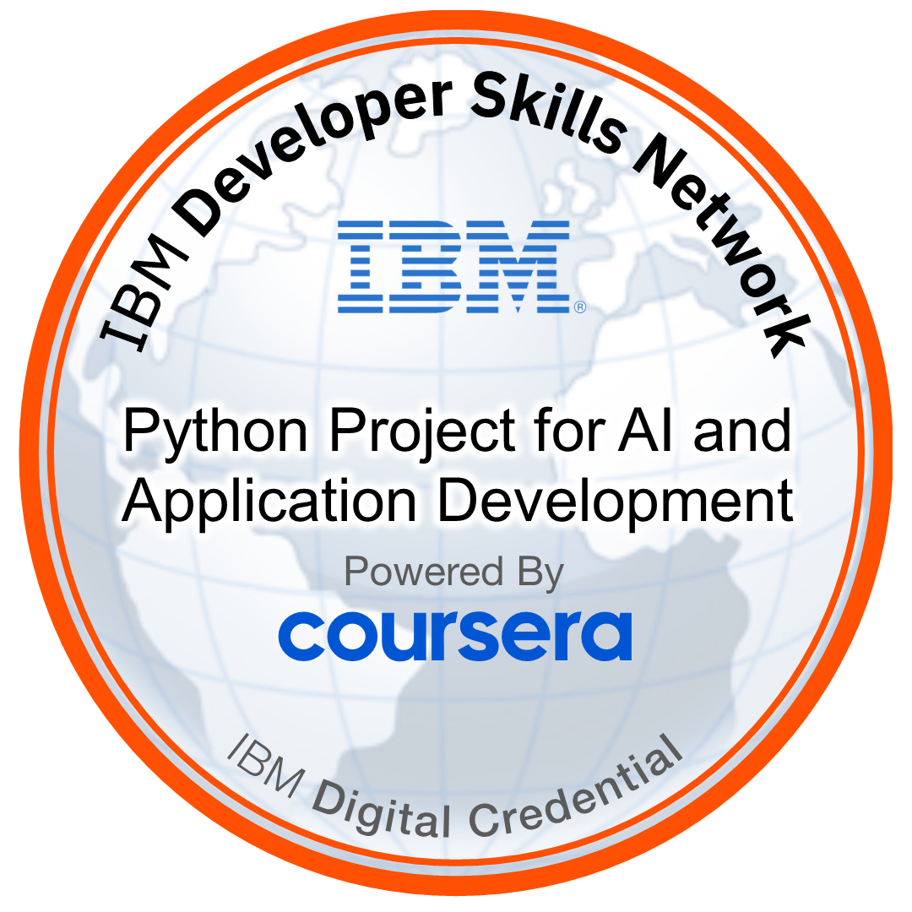

# Emotion Detector (IBM Embeddable AI · Flask)

[](#)
[](#)
[](#)
[](LICENSE)

AI-powered web app that detects **anger, disgust, fear, joy,** and **sadness** from text using the IBM **Embeddable Watson NLP** emotion workflow.  
Built as the final project for **Developing AI Applications with Python and Flask (IBM / Coursera)**.

> 🔖 **Badge earned:** (python-project-for-ai-and-application-development.png)

# 🎓 Certification

Cert URL PDF copy of my issued certificate: : .pdf



[Cert URL](https://www.coursera.org/learn/python-project-for-ai-application-development?specialization=devops-and-software-engineering)
PDF copy of my issued certificate: [.pdf](.pdf)


---

## ✨ Features

- Flask web UI (provided template) + `/emotionDetector` endpoint (GET & POST).
- Calls Watson NLP **EmotionPredict** and returns scores + `dominant_emotion`.
- Error handling for blank input (returns `Invalid text! Please try again!`).
- Unit tests (pytest) + **pylint 10/10** static analysis.

---

## 🗂 Project Structure

final_project/
├── EmotionDetection/
│ ├── init.py # package export: emotion_detector
│ └── emotion_detection.py # Watson client + formatting + error handling
├── server.py # Flask app + routes + formatting rules
├── templates/
│ └── index.html # provided UI
├── static/
│ └── mywebscript.js # provided script
├── test_emotion_detection.py # pytest cases
├── LICENSE
└── README.md

---

## 🚀 Run locally

Prereqs: Python 3.10+, `pip`

```bash
# from repo root (final_project/)
python3 -m pip install --upgrade pip
pip install flask==2.2.5 requests pytest pylint
python3 server.py
# open http://localhost:5000
```


---

# 🧪 Tests & Linting

```bash
pytest -q
# -> 1 passed

pylint server.py
# -> Your code has been rated at 10.00/10
```

--- 

# 🔌 API
# POST /emotionDetector

# Form field: textToAnalyze

```bash
curl -s -X POST -F 'textToAnalyze=I think I am having fun' http://localhost:5000/e
```

# GET /emotionDetector?textToAnalyze=...

(Useful for the provided UI.)

Response (example): 
```bash
For the given statement, the system response is 'anger': 0.029103195, 'disgust': 0.0067921067, 'fear': 0.027528232, 'joy': 0.876574 and 'sadness': 0.06151191. The dominant emotion is joy.
```

# 📝 Course Notes (living doc)

See Developing_AI_Applications_with_Python_and_Flask.md for condensed notes, cheatsheets, and quiz answers we compiled during Modules 1–3. (Add/commit this file to the repo root if it isn’t there yet.)

--- 

# 📸 Screenshot Checklist (Peer-graded)

1_folder_structure.png

2a_emotion_detection.png

2b_application_creation.png

3a_output_formatting.png

3b_formatted_output_test.png

4a_packaging.png

4b_packaging_test.png

5a_unit_testing.png

5b_unit_testing_result.png

6a_server.png

6b_deployment_test.png

7a_error_handling_function.png

7b_error_handling_server.png

7c_error_handling_interface.png

8a_server_modified.png

8b_static_code_analysis.png

---

# 🧾 License

This project uses the license in LICENSE
. Credits to the IBM Developer Skills Network for the starter UI assets.
